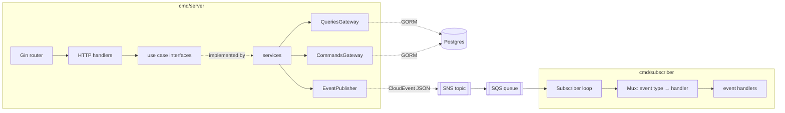

# go-ddd-template

[](go.mod)
[](LICENSE)
[](https://goreportcard.com/report/github.com/longntv/go-ddd-template)

A production-shaped Go service template built around Domain-Driven Design and CQRS-style ports.
It ships an HTTP API and an event subscriber that exchange [CloudEvents](https://cloudevents.io)
over SNS/SQS, with compile-time dependency injection, fast unit tests, and integration tests that
give every test its own Postgres database.

- **Layered architecture.** Domain, use case, service, infrastructure and handler layers with dependencies pointing inward.
- **CQRS ports.** Separate query and command gateways per aggregate.
- **Two binaries.** `cmd/server` (Gin HTTP API) and `cmd/subscriber` (SQS long-poll consumer), both with graceful shutdown.
- **Domain events.** CloudEvents published to SNS and routed by type in the subscriber.
- **[Wire](https://github.com/google/wire) dependency injection.** Generated, no reflection; a separate injector for tests.
- **Testing.** Table-driven unit tests with gomock and go-cmp, plus integration tests on per-test Postgres clones (`CREATE DATABASE … TEMPLATE`).
- **Local stack.** Postgres and LocalStack via Docker Compose, with the topic, queue and bucket created on startup.
- **Claude Code ready.** Project rules and skills for implementing features and writing tests ([see below](#using-with-claude-code)).

## Architecture



Services depend only on interfaces defined in the domain (`internal/domain/gateway`).
Infrastructure implements them, and Wire binds the implementations at build time.

## Project layout

```
cmd/
  server/               HTTP API entry point
  subscriber/           SQS/CloudEvents consumer entry point
internal/
  config/               environment-based configuration
  domain/               entities, domain events, ports (gateway), domain errors
  usecase/              use-case interfaces + input/output DTOs
  service/              use-case implementations
  infrastructure/       GORM datastore, AWS clients, CloudEvents publisher/subscriber
  handler/              HTTP handlers + router, CloudEvent handlers, health check
  registry/             Wire injectors (production)
  testutil/             template-database helpers for integration tests
  utils/                logger, clock, validator helpers
test/integration/       end-to-end HTTP tests + Wire injector for tests
testdata/fixtures/      YAML rows loaded into the test template database
database/migrations/    golang-migrate SQL migrations
docker/                 Dockerfile, Compose file, LocalStack init script
.claude/                Claude Code rules and skills
```

## Getting started

### Create your service from the template

Either click **Use this template** on GitHub, or use [`gonew`](https://go.dev/blog/gonew), which also
rewrites the module path:

```bash
go run golang.org/x/tools/cmd/gonew@latest github.com/longntv/go-ddd-template github.com/you/your-service
cd your-service
```

### Run it locally

Prerequisites: Go 1.23+, Docker, and the tools from `make tools/install` (wire, golangci-lint, migrate).

```bash
cp .env.example .env && set -a && . ./.env && set +a
make docker/up          # Postgres + LocalStack (creates the SNS topic, SQS queue and S3 bucket)
make db/migrate/up      # apply database/migrations
make run/server         # terminal 1: API on :8080
make run/subscriber     # terminal 2: consumes user events
```

```bash
curl -s -X POST localhost:8080/api/v1/users \
  -H 'Content-Type: application/json' \
  -d '{"name":"Alice","email":"alice@example.com","password":"password123"}'
# The subscriber logs: [UserCreated] User ID: …, Name: Alice, Email: alice@example.com
```

### API

| Method | Path | Description |
|---|---|---|
| `GET` | `/health` | Liveness check |
| `POST` | `/api/v1/users` | Create a user; publishes `com.go-ddd-template.user.created` |
| `GET` | `/api/v1/users?page=1&limit=10` | List users (`limit` 1–100; out-of-range values fall back to 10) |
| `GET` | `/api/v1/users/:id` | Get a user (404 if missing) |
| `PUT` | `/api/v1/users/:id` | Update a user; publishes `…user.updated` |
| `DELETE` | `/api/v1/users/:id` | Delete a user; publishes `…user.deleted` |

Configuration is read from environment variables; [`.env.example`](.env.example) lists them all with local defaults.

## Development

| Command | Description |
|---|---|
| `make run/server`, `make run/subscriber` | Run the binaries |
| `make test` | Unit tests (no services needed) |
| `make test/integration` | Integration tests against Postgres |
| `make test/coverage` | All tests (needs Postgres) with an HTML coverage report |
| `make generate` | Regenerate Wire injectors and mocks |
| `make lint` | golangci-lint |
| `make db/migrate/up`, `make db/migrate/create` | Migrations |
| `make docker/up`, `make docker/down` | Local infrastructure |

## Testing

### Unit tests: `make test`

Table-driven tests next to the code, using gomock mocks of the ports
(`internal/domain/gateway/mock`, `internal/usecase/mock`) and `go-cmp` for diffs.

| What | Where | Mocks |
|---|---|---|
| Use cases | `internal/service/*_test.go` | gateways + `EventPublisher` |
| HTTP handlers | `internal/handler/http/server/handler_test.go` | use cases, via `httptest` |
| Event routing | `internal/infrastructure/cloudevents/provider_test.go` | none |
| Entities | `internal/domain/entity/*_test.go` | none |

### Integration tests: `make test/integration`

These files carry `//go:build integration` and need Postgres. Use `make docker/up`, or point
`DB_HOST` / `DB_PORT` / `DB_USER` / `DB_PASSWORD` at any Postgres 13+ where the user may create databases.

1. `internal/testutil` builds a **template database** once per test binary. It runs
   `database/migrations/*.up.sql` and loads `testdata/fixtures/<table>.yml`.
2. Each test gets its own copy via `CREATE DATABASE … TEMPLATE`, dropped on cleanup. Tests run in
   parallel without sharing state, and nothing is left behind.
3. Reader tests share one read-only copy. Writer tests and HTTP tests take a fresh copy per case.
4. `test/integration/http` drives the real router, services and datastore through a test Wire
   injector that takes the database and a mock `EventPublisher` as parameters, so no AWS is needed.

## Using with Claude Code

The repository includes instructions for [Claude Code](https://docs.anthropic.com/en/docs/claude-code):

| File | Purpose |
|---|---|
| [`CLAUDE.md`](CLAUDE.md) | Project overview and commands, loaded every session |
| [`.claude/rules/architecture.md`](.claude/rules/architecture.md) | Layer, naming, error and wiring rules (applied to Go source files) |
| [`.claude/rules/testing.md`](.claude/rules/testing.md) | Test conventions (applied to test files and fixtures) |
| [`.claude/skills/ddd-implement`](.claude/skills/ddd-implement/SKILL.md) | Step-by-step: add an aggregate, use case, endpoint or event |
| [`.claude/skills/ddd-testing`](.claude/skills/ddd-testing/SKILL.md) | Step-by-step: unit, datastore and end-to-end tests, fixtures, troubleshooting |

For example: *"Add an Order aggregate with create/get/list endpoints and an OrderCreated event."*

## Roadmap

Tracked as [issues](https://github.com/longntv/go-ddd-template/issues):
- [#1](https://github.com/longntv/go-ddd-template/issues/1) Update use case should load, mutate and save the existing aggregate
- [#2](https://github.com/longntv/go-ddd-template/issues/2) Run use-case input validation
- [#3](https://github.com/longntv/go-ddd-template/issues/3) Subscriber dead-letter handling and concurrency
- [#4](https://github.com/longntv/go-ddd-template/issues/4) Transactional outbox for domain events

## Contributing

Contributions are welcome. See [CONTRIBUTING.md](CONTRIBUTING.md).

## License

[MIT](LICENSE)
